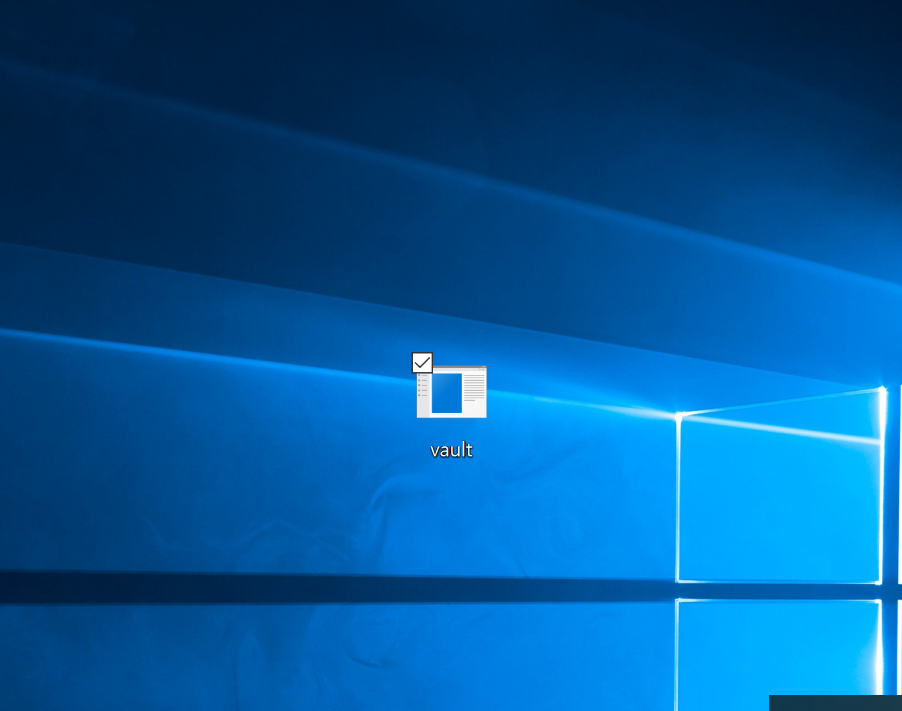
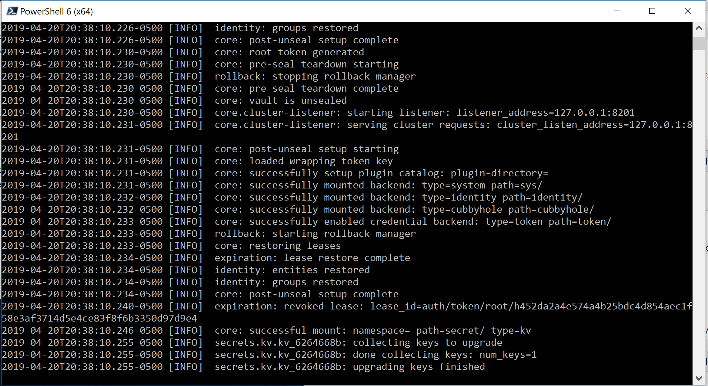
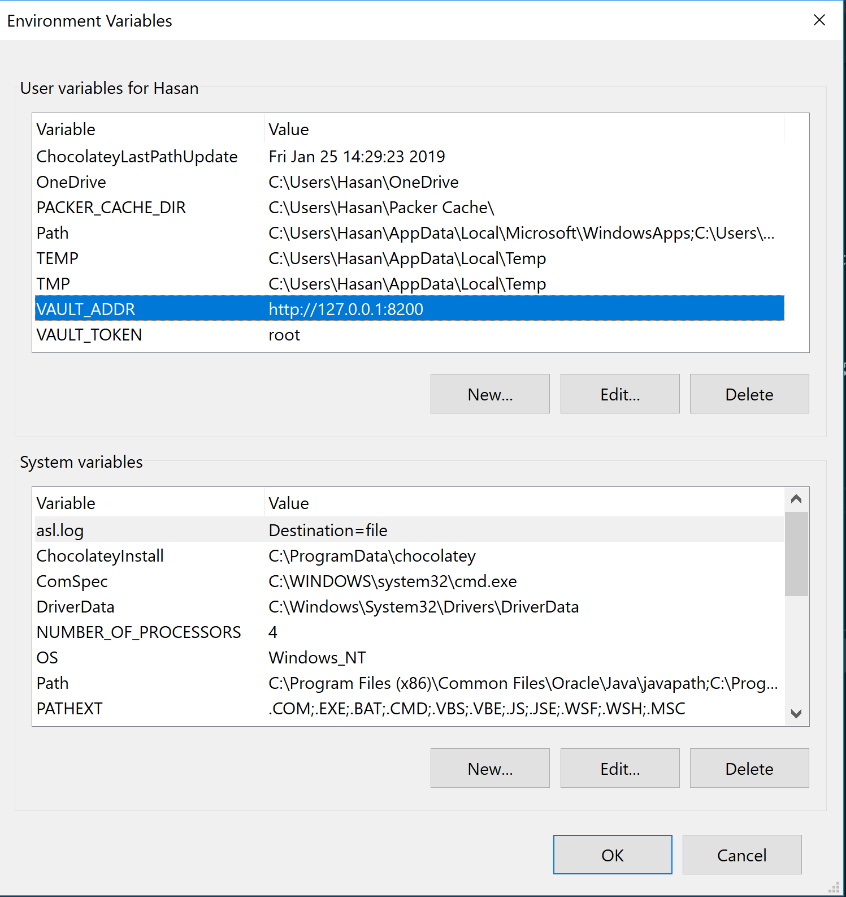
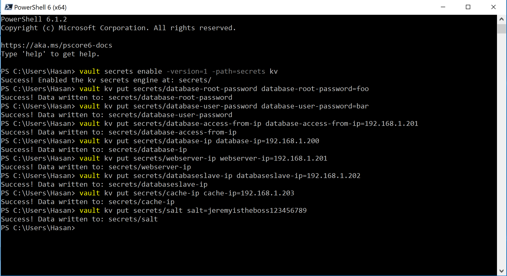
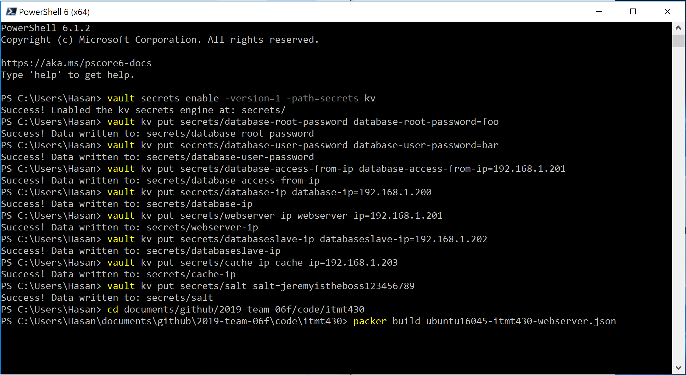
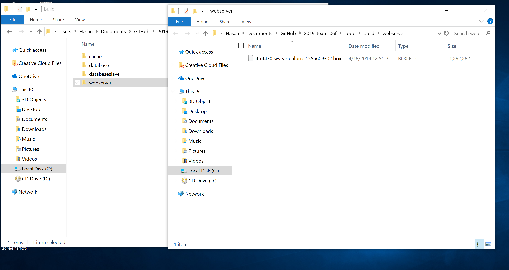
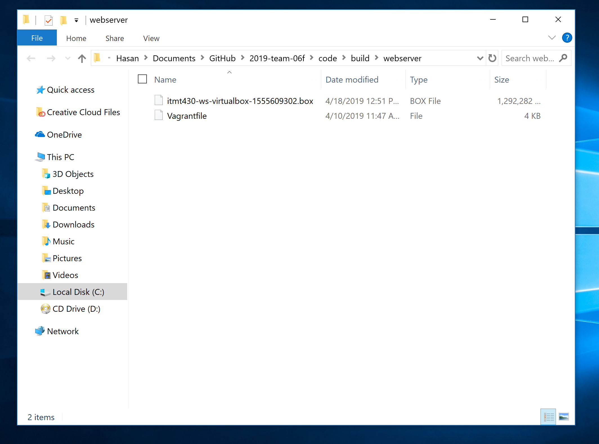
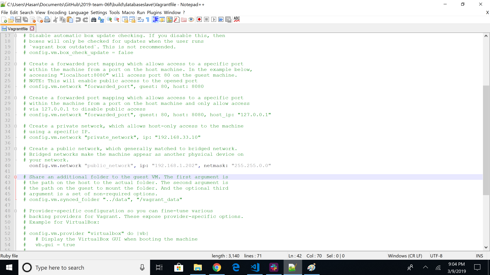

# Pre-steps to take
User variables allow your templates to be further configured with variables from the command-line, environment variables, Vault, or files. This lets you parameterize your templates so that you can keep secret tokens, environment-specific data, and other types of information out of your templates. This maximizes the portability of the template.

Secrets can be read from Vault and used within your template as user variables. the vault function is available only within the default value of a user variable, allowing you to default a user variable to an environment variable.

This is how we are passing passwords/RSA keys securely.

[https://www.packer.io/docs/templates/user-variables.html](https://www.packer.io/docs/templates/user-variables.html)

### What we need to set username and passwords securely in Packer
1) Installing Vault
   
   To install Vault, find the appropriate package for your system and download it. Vault is packaged as a zip archive.
   https://www.vaultproject.io/downloads.html
   
   After downloading Vault, unzip the package. Vault runs as a single binary named vault. Any other files in the package can be safely removed and Vault will still function.

   
   
   The final step is to make sure that the vault binary is available on the PATH. 
   
   See this page for instructions on setting the PATH on Linux and Mac. 
   https://stackoverflow.com/questions/14637979/how-to-permanently-set-path-on-linux-unix
   
   This page contains instructions for setting the PATH on Windows.
   https://stackoverflow.com/questions/1618280/where-can-i-set-path-to-make-exe-on-windows

1) Starting Vault
  
   To start the Vault dev server, open a new terminal and run:  
   ```posh
   vault server -dev -dev-root-token-id="root"
   ``` 

   
   Leave this terminal open

1) Setting Enviornment Variables for Vault
   
   You need to set two environment variables on your local machine for vault to be accessed properly by Packer 
   VAULT_ADDR='http://127.0.0.1:8200'  
   VAULT_TOKEN=root
   
   The link below shows how to configure environment variables on different operating systems.
   https://www.schrodinger.com/kb/1842
   
   Here is an image of the environment variables configured on Windows.

    


1) Inserting secrets into Vault
   
   To insert secrets into the Vault, open a new terminal and issue the following commands replacing default values with your own values:  
   ```posh 
   vault secrets enable -version=1 -path=secrets kv
   vault kv put secrets/database-root-password database-root-password=foo
   vault kv put secrets/database-user-password database-user-password=bar
   vault kv put secrets/database-access-from-ip database-access-from-ip=127.0.0.1
   vault kv put secrets/database-ip database-ip=127.0.0.1
   vault kv put secrets/webserver-ip webserver-ip=127.0.0.1
   vault kv put secrets/databaseslave-ip databaseslave-ip=127.0.0.1
   vault kv put secrets/cache-ip cache-ip=127.0.0.1
   vault kv put secrets/salt salt=jeremyistheboss123456789
   ```
    
1) Issue the commands inside of the code/itmt430 folder to begin the install with password, usernames, and RSA private key properly seeded. This way we can securely build the system, deploy it and when building it pass in passwords via environment variables 
   ```posh
   packer build ubuntu16045-itmt430-database.json
   packer build ubuntu16045-itmt430-webserver.json
   packer build ubuntu16045-itmt430-database-slave.json
   packer build ubuntu16045-itmt430-cache.json
   ```
    
1) Once all four servers are built, go the the build folder and create a seperate folder for each box file and move each one into it's specific folder. 
   
1) Issue the following commands inside the appropriate folders to add the boxes.  
   ```posh
   vagrant box add ./itmt430-db* --name database 
   vagrant box add ./itmt430-ws* --name webserver 
   vagrant box add ./itmt430-dbs* --name databaseslave
   vagrant box add ./itmt430-c* --name cache
   ```
   
1) Issue the following commands inside the appropriate folders to initialize each box and to place a Vagrantfile in each folder.    
   ```posh
   vagrant init database
   vagrant init webserver
   vagrant init databaseslave
   vagrant init cache
   ```
   
1) Configure the Vagrantfile for each server by uncommenting line 40 and replacing it with: 
   ```
   config.vm.network "public_network", ip: "127.0.0.1", netmask: "255.255.0.0"
   ``` 
   Replace the 127.0.0.1 with the ip used for that specific server in the Vault. Save the Vagrantfiles. 
   
1) Issue the following command for each of the servers. 
   ```posh
   vagrant up
   ```
1) To access TruHawk, enter the webserver IP into your web browser.