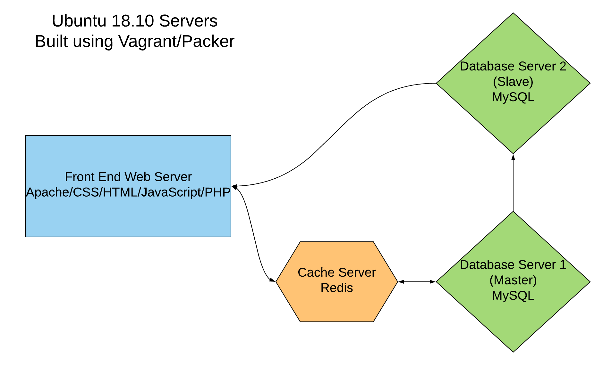
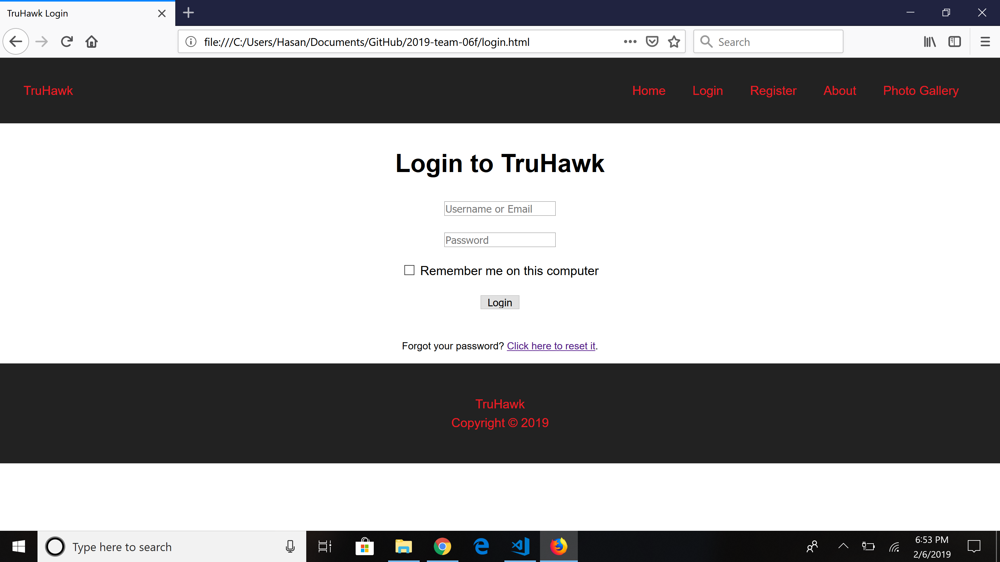

# Sprint 1 Report
## Team True
## Project: Flickr/Instagram Hybrid Internal Photo Search Site
## Site Name: TruHawk
### Roles
1. Project Manager -- Hasan Rizwan
2. Developer -- Daniel Kolov
3. Jr Developer -- Shan Shazad
4. IT Operations -- Bhumika Patel / Jason D’Souza
5. UI/UX Developer -- Sarina Stoker
#### Sprint Goals
- Choose Roles (C)
- Choose Project (C)
- Install Required Software (C)
- Get Acclimated Using Git (C)
- Get Acquainted Using Communication and Management Platforms (C)
- Decide on Language(s)/Framework(s) (C)
- Operating System Platform (C)
- Data Storage Technology (C)
- Start a home site design (C)
- Implement Responsive Slides on Website (C)
- Photo Gallery (C)
- Login Page (C)
- Lucidchart Diagram (C)
- Interface Design (C)
- Setting up our servers through Vagrant / Packer (I) 
#### Project Accomplishments: 14/15 Goals Accomplished
1. Language and Framework of Choice
   - a. HTML, CSS, Javascript
   - b. PHP
   - c. MySQL
   - d. Vagrant/Packer
   - e. Redis
2. Operating System
   - a. Linux - Ubuntu 18.10
3. Plan for Data Storage and Use of Master & Slave
   - a. 2 Database Servers running MySQL
   - b. 1 server will serve as a master server and 1 server will be a slave
4. Data Encryption
   - a. According to whatever database field we create, it will be encrypted using a symmetric cipher provided by OpenSSL. Password fields will be encrypted data using a one-way password hash.
   - b. We will continue to work on data encryption once we have a fully working functioning UI. 
5. Responsive Design
   - a. Website design will include mobile queries for resizing
6. Use of https
   - a. Port 443 will be utilized for https furthur in development
7. Use of User Authentication
   - a. Authenticated- Login with myIIT credentials
   - b. Unauthenticated- restricted features
8. Creation of Dev Environment (Upcoming)
9. Layout Design & Management of Visio 
   - a. Lucidchart diagram of infrastructure 
10. Management of Project Progress
    - a. Use of Slack and Trello
    - b. Updates are deployed to Github
11. 15 Real Test Users (Upcoming)

#### Reflections
Hasan - As the Project Manager I believe the most important accomplishment was to plan the infrastructure that is displayed in the flowchart. These last few weeks we were able to install all the necessary software that will assist us in deploying the virtual servers. I believe this first sprint primarily involved us coming up with a good plan to execute. Looking forward, I believe the foundation is set to start deploying virtual servers and developing the application. 

Bhumi - For this first sprint I was responsible for the IT Operations. I have engaged in the group activity to discussed how we want our website to be functioning according to the project requirements. So far, as per the need, I have set up the VirtualBox, vagrant, and packer that are required for the production environment of our project and making the “TruHawk” logo for the website. Our team has a static website up running and for the next sprint am looking forward to work with a team in building the dynamic website using PHP and MySQL for database storage and server deployment.

Shan - As the Jr. Developer for the first sprint I feel like we have accomplished a lot as a team. My goal for the first 3 weeks was to put together our website layout and have an idea where as a group we want to proceed. I think the most difficult part would be now having the site communicate with the backend server and having it actually work. 

Daniel - As a Developer, my goal was to work on our website, which will serve as an interface for the user to interact with our photo libraries. There is much work left to be done such as implementing a good search bar that will allow the user to look for photos by # or id. The registration page and the login page were my primary focus for those first few weeks and although they require some CSS polishing and more functionality added, there is some definite progress. All necessary software was installed and we are ready for the next phase where we will finish most of the website, start hosting it off our own server and creating database server/s.

Jason - As this is the first sprint and the beginning of the overall project, this phase primarily involved installing and getting used to the software that we’ll be using for the duration of the project, as well as an initial idea and an overall, documented plan to execute the idea. Overall, the team has accomplished a lot and will deliver more tangible results in future sprints.

Sarina - I do not have any tangible accomplishments this sprint because we were trying to grasp the requirements of the project, discussing different components and getting my machine running with the required software. I assisted in creating the report. Moving forward, I plan to have a better game plan for upcoming sprints.

#### Goals for Next Sprint:
- Create Visio Diagrams for site functionality
- Deploy the 4 virtual servers using Packer
- Implement PHP on our website 
- User Authentication
