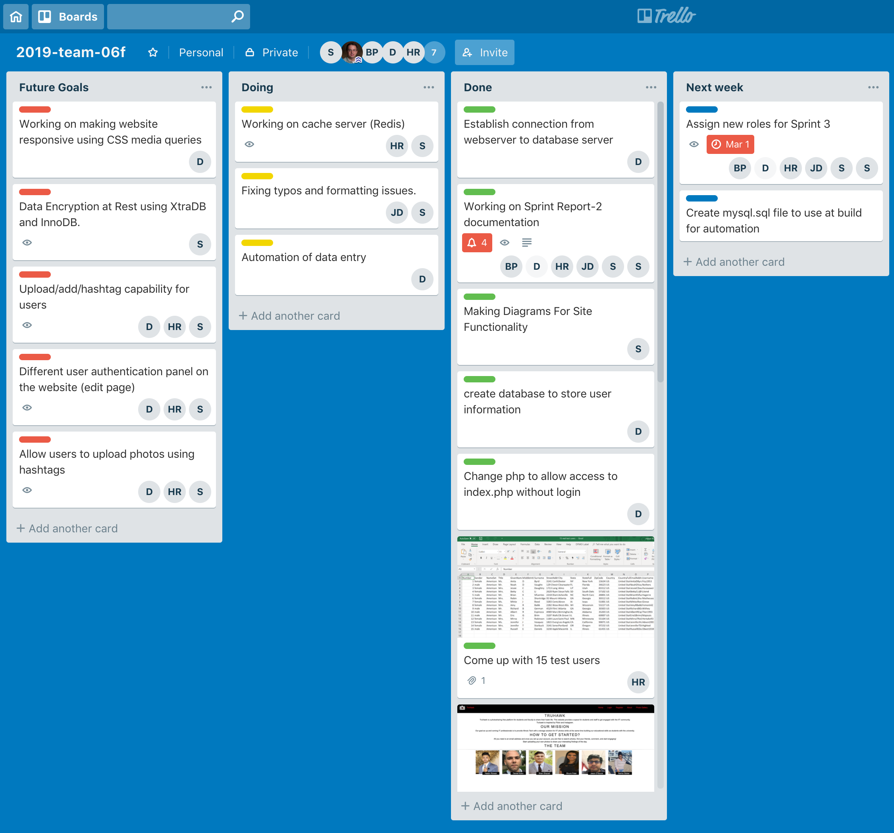
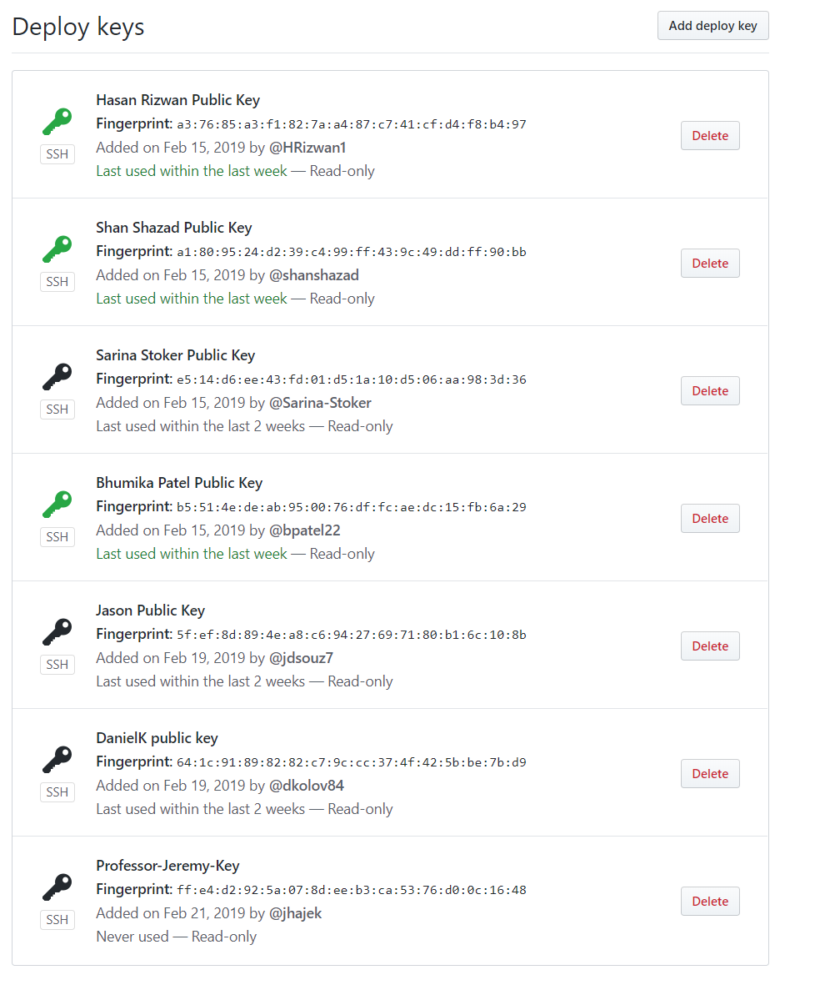

# Sprint 2 Report
## Team True
## Project: Flickr/Instagram Hybrid Internal Photo Search Site
## Site Name: TruHawk
### Roles
1. Project Manager -- Daniel Kolov
2. Developer -- Sarina Stoker
3. Jr Developer -- Jason D’Souza 
4. IT Operations -- Shan Shazad / Hasan Rizwan
5. UI/UX Developer -- Bhumika Patel

### Project Goals:

  * To build a web server (C)
  * To build a database server (C)
  * To get web server and database server running on everyone’s machine (C)
  * Configure vagrant files (C)
  * Implementing PHP to the register and login page (C)
  * To generate and deploy RSA keys of each member on GitHub (C)
  * Switching over from HTTP to HTTPS with valid security  (C)
  * To build the vagrant boxes with RSA keys (C)
  * Design About Page (C)
  * To make the website responsive in order to fit any form factor: desktop, mobile, tablet, or whatever is next (I)
  * To build cache server (I)
  * Create Diagrams for Site Functionality (C)

### Project Accomplishments: Goals Accomplished (9/12)

  * Configured vagrant files
  * Successfully deployed web server
  * Successfully deployed database server
  * Successfully built both a database and web server
  * Successfully implemented HTTPS
  * Connected the vagrant boxes with RSA keys
  * Successfully deployed RSA keys for each member via Github
  * Successfully built servers on each team member’s machine
  * Created Diagrams for Site Functionality

### Project Requirements:
1. Language and Framework of Choice:

  * HTML 
  * CSS to style our web pages 
  * Javascript / jQuery is used for the photo slideshow on the gallery page
  * PHPStorm used for login and register process
  * Vagrant/Packer is used for building the web server and database server
  * Apache
  * Redis
  * mariaDB server provides an SQL interface for accessing data
  
2. Operating System Platform:

  * Linux - Ubuntu 16.04.5
  
3. Use of Data Store:

  * We will be using 2 database servers ( Platform: MySQL)
  * Use of Master/Slave
    - One of the databases will be used to store our information (Master) and this will be the database which we write to. This database will store some of the initial photos provided by the instructor and photos that potentially would be uploaded by users. As well as this server will host the user information such as name, email, usernames & passwords.
    - The other database (Slave) will be the one which we read from. Photos will be queried from this database using javascript media queries for pictures to display on our website and internally in the user accounts.

4. Data Encryption at Rest:
  * Encrypted using a symmetric cipher provided by OpenSSL. Password fields will be encrypted data using a one-way password hash.
  * MariaDB 10.0.38 has Data at Rest Encryption and is fully supported for XtraDB and InnoDB.
  * MariaDB can allow our files to encrypt:
     - All tablespaces
     - Individual tables
     - Uses a 32-bit integer as a key identifier.
     - Encryption keys can also be rotated which basically creates a new version of the encryption key. Decryption is also readable through Maria’s file server keys. 

5. Use of Master & Slave Replication:
  * 2 Database Servers running MySQL - 1 server will serve as a master server and 1 server will be a slave.
  * 1 Apache web server that will host HTML, PHP, JavaScript and CSS 
  * 1 Redis cache server

Our setup will use the Apache server for providing the UI (our website) to the end user, information from registration page and users uploading photos would be written to the master database server. The master will be connected to a slave server which will hold a copy of the database used for reads. By separating writes and reads we will minimize the required movement of the disk head.  On the master database, separating writes from reads will free up resources to focus on writes only and minimize the movement of the head by writing a few queries in a sequence and only moving the head once every few writes to move the data into the “heap” (permanent storage in the database). On the slave database, reducing its functions to primarily reads will allow it to handle more queries by freeing resources for the job.

We will implement a Redis Cache server which will be placed between our Web server and Slave Database server and it will be responsible for storing a portion of the database entries and allow for faster searching and reads from the web server.

 
6. Responsive Design (In-progress):

Our goal is to design our website with Responsive Web Design (RWD) that adapts the layout to the viewing environment by using CSS media queries ( an extension of the @media rule).

“Why media queries?” - Media queries allow the page to use different CSS style rules based on characteristics of the device the site is being displayed on, most commonly the width of the browser.

Technically we want a media-rich, widescreen page for desktop viewing and a smaller size page formatted for small screen viewing, with less clutter, larger fonts and tighter-wrapping constraints for mobile viewing.

Below is the IPhone X view without the use of media queries, for next sprint we are going to use media queries to make the mobile view look better.

7. Use of HTTPS:

While it was once reserved primarily for passwords and other sensitive data, the entire web is gradually leaving HTTP behind and switching to HTTPS. The “S” in HTTPS stands for “Secure”. It’s the secure version of the standard “hypertext transfer protocol” your web browser uses when communicating with websites. It is important for our application to run on HTTPS to gain the trust of our users. We have generated a self-signed certificate. The certificate is issued by Team True at the Illinois Institute of Technology and is good for one year.

    

  * Firewall
    - Using UFW (Uncomplicated Firewall) in Apache 2:
    - Ideally, we want to limit the number of ports open and only want to use which we need. This is a list of open ports and our current firewall setup.
   
 

  * Authentication keys (if applicable) 
  * Seeding of usernames and passwords 
  * Pre-seeding databases/datastores with schema and records ----//
  
8. Use of User Authentication:

**Unauthenticated users access:** 

* Will have access to “read-only” data
* Restrict certain site features until they have created an account

**Authenticated normal users will have access to:**
  * Upload photos
  * View own photos
  * Search for photos (hashtags)
  
**Administrator Access:**
  * Custom made admin panel 
  * Able to delete other users photos
  * Able to delete accounts
9. Creation of Dev Environment:

10. Layout Design:
  * Home page:
  

  * Button Link:
  

  * Login & Register page:
  

  * Photo-Gallery page:
  

  * Site Flow:
  

11. Management of Visio Diagram:

Diagrams managed on a weekly basis or whenever we have an update by UI/UX and Project Manager. A tool that we are using to create diagrams is LucidChart.

12. Management of project progress:

Mostly all the communication and update process for this project is done through slack. We are keeping track of our to-do, in-progress and done tasks through trello. Upon the completion of the task, the person assigned to that task moves the card to the done section.

  * Trello:
  

  * Slack:

  * Github:
  
  
  
13. Test Users:

Fifteen test users were generated, and data will be injected into our MariaDB database at build. For the purpose, ‘.sql’ file will be created with the insert command to add values into the username, password and other account required fields.

**Any issues/Bugs?**

We had an issue with our web server not working in the lab. It might be just a matter of restarting the system we were tasting on and we will attempt it again at our next meeting in the smart lab.

We also had an issue where mariadb was not granting permissions to the user "worker" and it turned out after countless hours of hair pulling that it was missing '' surrounding the IP address.

**Goals for Next Sprint:**
  * Successfully build and deploy a cache server (with Redis)
  * Continue to manage diagrams as new pieces are implemented
  * Have a full functioning website user and admin panel
  * Data Encryption at Rest
  * To focus more on responsive design, having the website function properly in multiple form factors, such on mobile, tablet, etc.

#### Individual Reflections
**Daniel** - Over this sprint duration, I believe the team was able to make great progress. Personally, I was able to incorporate PHP into our website to allow for registration and login to work as well as show login status in the header of the webpage. Error handling PHP was also implemented and our PHP checks for invalid input on registration to prevent false values from being entered. I was able to successfully connect our web server and database server. User data table was created and stores user information when entered on our registration form. Permissions and the connection to MariaDB took some time, but in the end, it all works satisfactorily. Some polishing of CSS on the registration and login page was done, with more work to come. 

**Sarina** - For this sprint spent some time researching “about page” examples to get an idea of the kind of information we could have and I coded the html content for about page. I also did some troubleshooting with the css for the about page. I spent time correcting typos and formatting issues that I found in our code. Since a big part of this sprint was focused on the servers, I spent time getting the web server and database server on my machine as well as troubleshooting errors with it. I sought my team for help during this time. I spent some time creating the diagrams for the layout of our pages and site functionality. Lastly, I assisted in the creation of this report.

**Jason** - In this sprint I think we accomplished a lot as a team. My role for this sprint was IT operations along with Shan.  At the beginning of the sprint we were focused on getting the servers deployed on everyone’s machine. We were able to configure the script for the build to host our site successfully on everyone’s computer. Afterwards, we started working on implementing HTTPS for the website. Once we had HTTPS working, we were able to automate it and implement it into the build script. Working with Daniel we were even able to get the sign up page to work. However, we were not able to implement it into the build script without bugs. We will work on that on the next sprint and try to improve our application.  

**Shan** -  A big difference from the last sprint is that we were able to take quick initiative to knock out some goals for this sprint. As the IT operations, I worked closely with Hasan so as to implement automation deployment with Packer/Vagrant server environment. We were able to effectively work on helping everyone to be familiar how Vagrant/Packer works. The security aspects which was a success was the HTTPS self-signing certificate and with the help of Hasan he was able to automate this feature. I took over some website pages which needed to be changed, for example the about me page which has a brief overview of the site, and our team photos properly aligned. Daniel was able to get the login/register page to work with the backend, so we're headed to the right direction. Once we start getting in more data, data encryption and visual layout of the user authentication are my next few goals.

**Hasan** - In this sprint I think we accomplished a lot as a team. My role for this sprint was IT operations along with Shan.  At the beginning of the sprint we were focused on getting the servers deployed on everyone’s machine. We were able to configure the script for the build to host our site successfully on everyone’s computer. Afterwards, we started working on implementing HTTPS for the website. Once we had HTTPS working, we were able to automate it and implement it into the build script. Working with Daniel we were even able to get the sign up page to work. However, we were not able to implement it into the build script without bugs. We will work on that on the next sprint and try to improve our application.  

**Bhumi** - As a UI/UX Designer my responsibility was to illustrate design ideas, gathering information required for web functionality, test the website frequently, fixing typos, identifying and troubleshooting UX problems including responsiveness especially for the small devices such as mobile phones which remained incomplete this sprint but will be fixed by next sprint. During this sprint, I learned how to deploy database and web server on my machine with the help of IT Operators. At this point, our team has achieved many goals including we got our two servers successfully running, got our website from HTTP to https which is technically considered as a secure connection.
