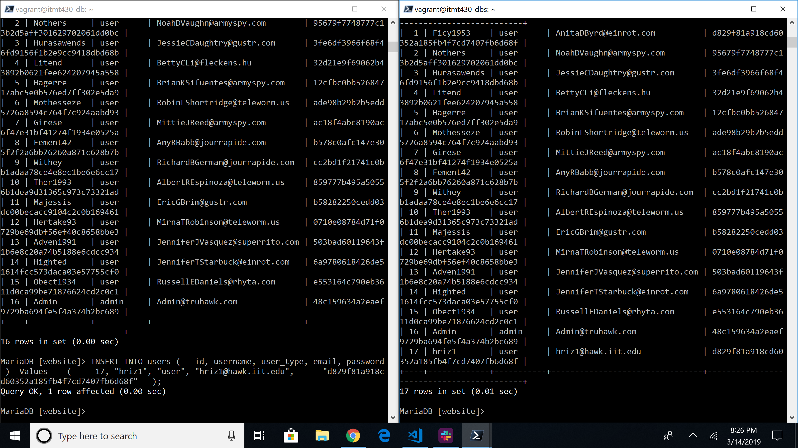
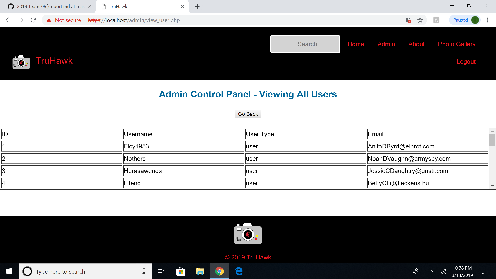
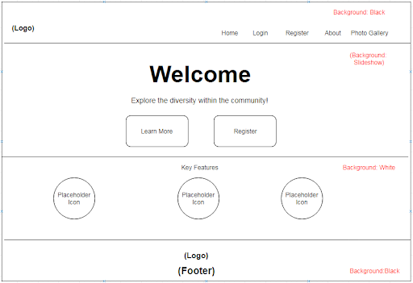

# Sprint 3 Report
## Team True
## Project: Flickr/Instagram Hybrid Internal Photo Search Site
## Site Name: TruHawk
### Roles
1. Project Manager -- Sarina Stoker
2. Developer -- Shan Shazad / Hasan Rizwan
3. Jr Developer -- Bhumi Patel
4. IT Operations -- Daniel Kolov
5. UI/UX Developer -- Jason D'Souza

### Project Goals:

* To build a slave database server using Packer (C)
* To build Redis cache server using Packer (C)
* Fix binding error (50-server.cnf is ignored causing a binding error due to permissions) (C)
* Create layout diagrams for user/admin interface  (C)
* Designed and create tables for users and pictures using MariaDB (C)
* Create “create-new.sql” and “insert-new.sql” files to use at build for automation (C)
* Create admin panel to view all users and to create admins / regular users (C)
* Create an upload button for a registered user to upload photos (C)
* Restricted privileges for unregistered : only read access (index page) (C)
* To develop the user panel by allowing registered users to upload photos (C)
* Gather 225 images for 15 test users and store all the images in our database (C)
* Insert photo hashtags for all the images in our database (C)
* Be able to display photos from the database (C)
* Fix footer position on the admin page (C)
* Added a vertical scroll bar table onto the admin page view all users (C)
* Change md5 hash password to SHA1-hash-SHA-1 with salt to hash the user passwords (C)
* Allow registered users to upload images using hashtags (I)
* Functioning "Search-box" for registered users to search images using (hashtags) (I)
* Data Encryption at Rest using XtraDB and InnoDB (I) 
* Working on the upload feature to link pictures that belong to each user (I)
* Design responsive web design using CSS media queries in order to fit into devices such as desktop, mobiles, and iPad (I)
* Incorporate Riemann for capture of application metrics (I)

### Project Accomplishments: Goals Accomplished (17/20)

* Successfully built a slave database server using Packer
* Built Redis cache server using Packer
* Fixed binding Error:50-server.cnf (ignored causing a binding error due to permissions) from one of our github issues last sprint
* Created layouts for user/admin interface
* Designed & Created tables for users and pictures using MariaDB
* Created “create-new.sql” and “insert-new.sql” files to use at build for automation
* Created Admin panel to view all users and to create admins / regular users
* User Panel created
* Created upload feature-button for registered users to upload images
* Restricted privileges for unregistered users have only read access to index page
* To develop the user panel by allowing registered users to upload images
* Gathered images for 15 test user and stored all these images in the database (225 photos downloaded)
* Inserted Photo hashtags for all the images in the database
* Website pulls from the database to display photos in user accounts
* Fixed the footer on the admin page
* Added a vertical scroll bar table into admin page view all users
* Successfully changed md5 hash password to SHA1-hash-SHA-1 with salt to hash the user passwords
* Users can upload images from their registered account

### Project Requirements:
1. Language and Framework of Choice:

  * HTML-5 is used to structure the webpages
  * CSS-3 is used to style our web pages 
  * Javascript / jQuery is used for the photo slideshow on the gallery page
  * PHP is used for login and registering process
  * Vagrant/Packer are used for building and automating the building of the servers
  * Apache 2.4.18 (Ubuntu) web server hosts HTML, PHP, Javascript, and CSS
  * Redis 5.0.3 is used as in-memory data structure store and allow for faster searching and to cache data from the webserver
  * MariaDB Server 10.0.38 provides an SQL interface for accessing data
  
2. Operating System Platform:

    a. Linux - Ubuntu 16.04.5

    b. Process of secrets management: gitignore, openSSL, SSH key

      * Gitignore - The gitignore file was created for the purpose of preventing files from being uploaded without needing to explicitly exclude them. Any file added to gitignore is not included in git commits. Using gitignore allows system-specific files to be untouched, and it ensures that those sensitive files will never get uploaded.

      * OpenSSL - Purpose of using openSSL is to keep the sending and receiving traffic safe and secure between the server and clients without the possibility of the messages being intercepted by outside parties.

      *  SSH Key - To automate secure access to the servers, bypassing the need to manually enter login credentials. The SSH key provides strong, encrypted verification and communication between the user and a remote computer. RSA keys are used to verify users before allowing the cloning of our private repository into the remote servers.

      * SHA1-hash - We used SHA-1 with salt to hash our passwords

      

      * Privileges - Unregistered users cannot view photos; Admins have the ability to view and create new users

    c. Capture of application metrics: 

      * Riemann 0.3.1 is going to be used for capture of application metrics. We plan to incorporate this in the next sprint. 
      
  
3. Use of Data Store:
  * We are using 2 database servers (Platform: MariaDB/MySQL)
  * One of the database servers serves as the master which we write to. One of the uses of this database is that it is the one that is manipulated by our application. All writes are done to this database. This means that all user information and photos are written to this database.
  * The other database server serves as the slave and is the database which we read from. User information and photos are transferred from the master database to this database using a replication process. Our application uses this database to pull the information and photos.
  * One Redis Cache Server is used for caching the data, which is sent between the slave database and webserver. Redis is a NoSQL key-value data store. For storing a value, we associate it with a key and store it in Redis. The purpose of using Redis caching is to improve the database loading performance.

4. Data Encryption at Rest:

  * Encrypted using a symmetric cipher provided by OpenSSL. Password fields are encrypted using SHA1-hash with salt (salt concatenates random data with the hash)
  * MariaDB 10.0.38 has Data at Rest Encryption and is fully supported for XtraDB and InnoDB. 
  
  * XtraDB: A storage engine for the MariaDB 
  
  * InnoDB: A storage engine for the database management system MySQL. 
  
  * MariaDB allow our files to encrypt:
     - All tablespaces
     - Individual tables
     - Uses a 32-bit integer as a key identifier.
     - Encryption keys can also be rotated, which basically creates a new version of the encryption key. Decryption is also readable through Maria’s file server keys. 

5. Use of MySQL/MariaDB Database Master-Slave Replication:
  * Database Schema:
  
  * 2-Database Servers running MySQL/MariaDB - 1 server serves as a master server and another serves as a slave. Master and slave servers are connected.
  * The purpose of using the master-slave replication process is to enable data from one MySQL database server (serving as 'the master') to be copied automatically to another MySQL databse server (which serves as 'the slave'). 
  * The master-slave replication is a one-way replication (from master to slave); the master database is used only for the write operations, while the slave database is only used for read operations.
  
  * During designing or deploying the application, all the write operations (statement/query that changes the state of the database) are executed ONLY on the master server. As to minimize the risk of data conflicts on the slave, changes can only be made through the replication process. 
  * 1 Apache web server hosts HTML, PHP, JavaScript and CSS
  * 1 Redis Cache server

  
Our setup uses the Apache server for providing the UI (our website) to the end user; information from the registration page and users uploading photos are written to the master database server. The master is connected to a slave server, which holds a copy of the database used for reads. Writes and reads are separated to minimize the required movement of the disk head. On the master database, separating write from read frees up resources to focus on writes only and minimize the movement of the head by writing a few queries in a sequence and only moving the head once every few writes, in order to move the data into the “heap” (permanent storage in the database). On the slave database, reducing its functions to primarily reads allows it to handle more queries by freeing resources for the job.

  
A Redis Cache server is placed between our Web server and Slave Database server and is responsible for storing a portion of the database entries and allows for faster searching and queries entered on the web server.

 
6. Responsive Design (In-progress):

 Responsive Web Design is in progress. The overall goal is to make the website scale and adapt to multiple form factors and screen sizes, such as when using a smartphones or tablet. 

7. Use of HTTPS:

  
The entire website has left HTTP behind and switched to HTTPS. The “S” in HTTPS stands for “Secure”. It’s the secure version of the standard “hypertext transfer protocol” your web browser uses when communicating with websites. It is important for our application to run on HTTPS to gain the trust of our users. We have generated a self-signed certificate. The certificate is issued by Team True at the Illinois Institute of Technology and is good for one year.

    
  

  

  
  * Firewall
    - Using UFW (Uncomplicated Firewall) in Apache 2:
    - Ideally, we want to limit the number of ports open and only want to use which we need. This is a list of open ports and our current firewall setup.
   
   

  * Authentication keys (if applicable) 
  * Seeding of username and passwords as well as pre-seeding databases with schema and records is done on build using packer build scripts. 
  
8. Use of User Authentication:

  **Unauthenticated users access:** 

  * Have access to “read-only” data
  * Restricted features until account created (cannot view gallery or have any access to photos without an account)
  **Authenticated normal users have access to:**
  * Upload photos
  * View own photos
  * Search for photos (hashtags)
    
  **Administrator Access:**
  * Custom made admin panel
  * Able to create accounts (admin or user)
  * Able to view all accounts
  
  
  
  

9. Creation of Dev Environment:

  
 We have created the webserver, database master and slave, as well as the cache server using Packer. All of our servers are currently deployable. 

  

  

  We are able to deploy all 4 servers using Packer build. Any issues or bugs during deployment or issues with UI/UX are reported using Github Issues. These Github Issues are then furthur assigned as tasks to the appropriate team members to fix. 

10. Layout Design:
  * Home page:
  
  

  * Button Link:
  
  

  * Login & Register page:
  
  

  * Photo-Gallery page:
  
  

  * User Panel:

  

  * Upload Photo:

  

  * Admin Panel:

  

  * Create User:

  

  * View User:

  

  * Site Flow:
  
  
  

11. Management of Visio Diagram:
  
Diagrams are managed on a weekly basis, with continual updates by the UI/UX leader and Project Manager. Two tools that we are using to create diagrams is LucidChart and Draw.io.

  
  

12. Management of project progress:

  
 All the communication and update processes for this project are done through Slack. We have integrated Github on Slack so that commits are shown immediately in order to update the team on any changes made. We are keeping track of our to-do, in-progress and done tasks through Trello. Upon the completion of a task, the person assigned to that task moves the card to the done section. We are keeping in contact through out the duration of the sprint via Slack to update each other on accomplishments/issues.

  * Trello:
  
  

  * Slack:

  

  * Github Issues:

  
  
  * Github:
  
    
  
13. Test Users:
  
Fifteen test users were generated with the help of http://fakenamegenerator.com/ , and that data is being inserted into our MariaDB databases at build. New users can be added or deleted from the database thereafter. For said purpose, ‘.sql’ files are being used with the insert command to add values into the username, user_type, email and password fields. Fifteen images are being inserted for each user.  

  
  

**Any issues/Bugs?**
  
We  had an issue where mariadb was not granting permissions to the user "worker" and it turned out, after countless hours of hair pulling, that it was missing '' surrounding the IP address.

  

  
We looked into incorporating Cloudinary into our website but found that it is used by our competitor. They have some great tagging and searching features for images. However, incorporating the Cloudinary API into our application leaves our website useless if their servers go down. As a group, we decided to continue developing features for our own application, as opposed to using an API.

**Goals for Next Sprint:**
  * Responsive Web design, making the website function properly and scale to multiple form factors: smartphones & tablet.
    - Include mobile first css which will detect screen size and style our webpage according to device it's being used on.
    - Add JQueries that will assure a great user experience on any screen size.
  * Data Encryption at Rest using XtraDB and InnoDB
  * Allow registered users to upload photos using hashtags
  * Capture of application metrics using Riemann 0.3.1
  * Continue on coding the upload feature to link pictures that belong to each user
  * Functioning search box that will allow registered users to search for images using hashtags.
  * Assign new team roles for the next sprint

#### Individual Reflections
**Daniel** - My progress for the current sprint was getting the photo uploads to succesfully create records and store our photos in the database. Also the ability to display those photos that are in the database was implemented. The code needs some work to be able to sort all the photos by the userid (in users table), which is passed as a foreign key to our photos table. The idea is there just has not been implemented yet, but will be completed by next sprint. Adding the userid is one step of displaying our photos the way we want them to, the second part is to provide functionality to our search bar so we can search for photos by date uploaded or hashtag. Worked closely with Hasan and Shan to create the mariaDb schema.

**Sarina** - This sprint I was the project manager. I worked with my team rebuilding my servers on my local computer. I also managed the trello board with my group by archiving cards adding new tasks and moving things around. I started on our midterm report with assistance from Bhumi, until we found out that it was individual so that was scratched. I contributed to and edited all throughout this sprint report. I also was responsible for the updating of the diagrams. As the presenter of our progress this week, I spent time to meet up with my group to go over our presentation and practice demos.

**Jason** - Even though this sprint was a short duration, the team has accomplished alot and has made great progress towards the overall goals of this project. In this sprint, I was the UI/UX developer and was mainly responsible for the implementation of responsive design. There has been some progress made, but I am still in the process of learning about responsive design and experimenting to see what works and how to scale each element. Responsive design is still in progress, with hopefully a majority of it done, if not all, by next sprint. However, the website is looking more fleshed out, with a few pieces left as the team has made great strides to put all of this together.  

**Shan** - Even though this was a short sprint, we were challenged and pressured to get things implemented the right way. I was responsible for the admin/user account panel. This account functionality allows different user types to see based on their account role. I do plan on adding more features under the admin panel such as delete users and photos but for now it looks good. I also made sure that different pages can only be accessed, meaning that normal users cannot see the admin panel. I worked on adding CSS to our pages making sure it looks correct on everyone's computer and collaborating with Hasan on SHA1 hashing with salt password encryption. My goals for the next sprint are to further work on our upload, searching photos, and data encyrption at rest. Overall, we all made some great progress! 

**Hasan** - I think we were able to make very good progress this sprint. Although we only had two weeks in between sprints I believe we made the best of it. In this sprint I worked with Shan to implement SHA1 hashing with salt. On my own, I was able to create a functional database slave and a cache server. Also, I worked closely with Daniel to implement the upload page. I worked with Bhumi to preseed the database with user information and pictures. I think as a group we accomplished alot and in the next sprint I plan to work on monitoring application metrics, data encryption at rest, and a functioning search box.     

**Bhumi** - As a Jr. Developer my responsibility was to work with the main Developers to develop the functionality of the website. I have helped the main developers to download the images (225 images for 15 users) and helped them to insert the hashtags for those images in the database. Also I have helped the teammates to document the report. During this sprint our team has successfully accomplished many difficult tasks that were challenging such as changing md5 hash password to SHA1 hashing with salt and creating admin panel that allows admin to create new users, allow registered users to upload images. So far our team has made really good progress and we already have our goals set to achieve for the upcoming sprint.