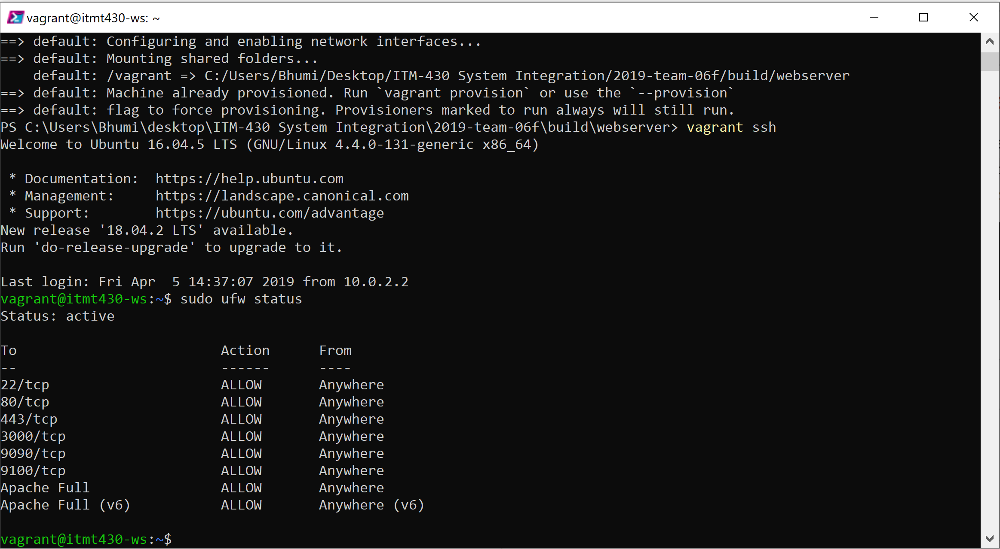

# Sprint-6 Report
## Team True
## Project: Flickr/Instagram Hybrid Internal Photo Search Site
## Site Name: TruHawk

### Roles:

1. Project Manager -- Shan Shazad
2. Developer -- Hasan Rizwan
3. Jr Developer -- Daniel Kolov / Jason D'Souza
4. IT Operations -- Bhumi Patel
5. UI/UX Developer -- Sarina Stoker

### Project Goals:

* Incorporating HashiCorp Vault for data encryption and to secure SQL databases and RSA Keys.
* Design responsive web design using CSS media queries in order to adapt the layout on devices such as mobile and ipads.
* The delete user page is unable to delete users that have uploaded pictures due to a foreign key constraint.
* The current version of MariaDB that we are running doesn't have file key management which is necessary for database encryption.
* Data Encryption for Data in transit.
* Data Encryption at Rest using XtraDB and InnoDB.
* Moving Prometheus into a new server.

### Project Accomplishments: Goals Accomplished (5/10)
* Incorporating HashiCorp Vault for data encryption and to secure SQL databases and RSA Keys.

### Project Requirements:
1. Language and Framework of Choice:

 * HTML-5 and CSS are delivered by PHP Version 7.3
 * Javascript is used for the photo slideshow on the gallery page
 * Vagrant/Packer is used for building and automating the building of the servers
 * Apache 2.4.18 (Ubuntu) webserver hosts HTML, PHP, Javascript, and CSS
 * Redis 5.0.3 is used as in-memory data structure store and allows for faster searching and to cache data from the web server
 * MariaDB Server 10.0.38 provides a SQL interface for accessing data

 2. Operating System Platform: 

   a. Linux - Ubuntu 16.04.5

   b. Process of secrets management: gitignore, openSSL, SSH key, HashiCorp Vault

  * Gitignore - The gitignore file was created for the purpose of preventing files from being uploaded without needing to explicitly exclude them. Any file added to gitignore is not included in git commits. Using gitignore allows system-specific files to be untouched, and it ensures that those sensitive files will never get uploaded.

  

  * OpenSSL - Purpose of using openSSL is to keep the sending and receiving traffic safe and secure between the server and clients without the possibility of the messages being intercepted by outside parties.

  * SSH Key - To automate secure access to the servers, bypassing the need to manually enter log-in credentials. The SSH key provides strong, encrypted verification and communication between the user and a remote computer. RSA keys are used to verify users before allowing the cloning of our private repository into the remote servers.

  * SHA1-hash - We used SHA-1 with salt to hash our passwords

  

  * Privileges - Unregistered users cannot view photos; Admins have the ability to view and create new users

  * HashiCorp Vault - Vault by HashiCorp is a tool for securely managing secrets. A secret is anything that you want to tightly control access to, such as API keys, passwords, or certificates. Vault provides a unified interface to any secret while providing tight access control and recording a detailed audit log. We plan to incorporate HashiCorp Vault to secure SQL databases and RSA Keys in the next and final sprint.

    

  

  c. Capture of application metrics:

  * We used Prometheus as a tool to capture application metrics. Prometheus is an open-source monitoring system that collects metrics from our services and stores it in a time-series database. Prometheus provides a basic web interface for monitoring the status os itself and its exporters, executing queries, and generating graphs.

  

  * In order to integrate with complex data from Prometheus, we have used a tool called Grafana which is a completely open-source tool for data visualization and a monitoring system that collects metrics from our services. Grafana has a feature-rich metrics dashboard and graph editor for Prometheus and it also allows to query, create alerts, notifications, and ad-hoc filters for our service, which we might incorporate in the next sprint.

  

  * To expand Prometheus beyond capturing metrics about itself only, we have installed an additional exporter called Node Exporter. Node Exporter is a Prometheus exporter that provides detailed information about the system, including CPU, disk, and memory usage. It will expose the webserver's metrics through Prometheus.

  
    
    

 3. Use of Data Store:

 * We are using 2 database servers (Platform: MariaDB/MySQL)
 * One of the database servers serves as the master which we write to. One of the uses of this database is that it is the one that is manipulated by our application. All writes are done to this database. This means that all user information and photos are written to this database.
 * The other database server serves as the slave and is the database which we read from. User information and photos are transferred from the master database to this database using a replication process. Our application uses this database to pull information and photos.
 * One Redis Cache Server is used for caching the data, which is sent between the slave database and web server. Redis is a NoSQL key-value data store. For storing a value, we associate it with a key and store it in Redis. The purpose of using Redis caching is to improve database loading performance.

4. Data Encryption at Rest:

 * Encrypted using a symmetric cipher provided by OpenSSL. Password fields are encrypted using SHA1-hash with salt (salt concatenates random data with the hash)
 * MariaDB 10.1 has Data at Rest Encryption and is fully supported for XtraDB and InnoDB.
  * XtraDB: A storage engine for the MariaDB
  * InnoDB: A storage engine for the database management system MySQL.
  * MariaDB allow our files to encrypt:
    - All tablespaces
    - Individual tables
    - Uses a 32-bit integer as a key identifier.
    - Encryption keys can also be rotated, which basically creates a new version of the encryption key. Decryption is also readable through Maria’s file server keys.

5. Use of MySQL/MariaDB Database Master-Slave Replication:

 * Database Schema:
 
 * 2-Database Servers running MySQL/MariaDB - 1 server serves as a master server and another serves as a slave. Master and slave servers are connected.
 * The purpose of using the master-slave replication process is to enable data from one MySQL database server (serving as 'the master') to be copied automatically to another MySQL database server (which serves as 'the slave').
 * The master-slave replication is a one-way replication (from master to slave); the master database is used only for the write operations, while the slave database is only used for reading operations.
 
 * During designing or deploying the application, all the write operations (statement/query that changes the state of the database) are executed ONLY on the master server. As to minimize the risk of data conflicts on the slave, changes can only be made through the replication process.
 * 1 Apache web server hosts HTML, PHP, JavaScript and CSS
 * 1 Redis Cache server

 Our setup uses the Apache server for providing the UI (our website) to the end user; information from the registration page and users uploading photos are written to the master database server. The master is connected to a slave server, which holds a copy of the database used for reads. Writes and reads are separated to minimize the required movement of the disk head. On the master database, separating write from read frees up resources to focus on writes only and minimize the movement of the head by writing a few queries in a sequence and only moving the head once every few writes, in order to move the data into the “heap” (permanent storage in the database). On the slave database, reducing its functions to primarily reads allows it to handle more queries by freeing resources for the job.
 A Redis Cache server is placed between our Web server and Slave Database server and is responsible for storing a portion of the database entries and allows for faster searching and queries entered on the web server.)

6. Responsive Design:

Responsive Web Design is in progress. The overall goal is to make the website scale and adapt to multiple form factors and screen sizes, such as when using a smartphone or tablet. We have added media queries into the css file (style.css) based on expected screen sizes. We have also added styling to reposition, resize and hide elements. There is no framework being specifically utilized for responsive design, as the framework currently being used is Font Awesome, and queries are stored in a css styles page. Will be experimenting and looking into a framework called W3.CSS as this framework has built-in responsiveness, supports responsive mobile-first design by default, equality for all devices and browsers, as well as being simpler and faster.
Mobile media queries commit: https://github.com/illinoistech-itm/2019-team-06f/commit/f01aa997eb2ae30e1bb8594390a03c961755285a#diff-c13367945d5d4c91047b3b50234aa7ab

7. Use of HTTPS:

 The entire website has left HTTP behind and switched to HTTPS. The “S” in HTTPS stands for “Secure”. It’s the secure version of the standard “hypertext transfer protocol” your web browser uses when communicating with websites. It is important for our application to run on HTTPS to gain the trust of our users. We have generated a self-signed certificate. The certificate is issued by Team True at the Illinois Institute of Technology and is good for one year.
  
 

 

 

 * Firewall:

   - Using UFW (Uncomplicated Firewall) in Apache 2:
   - Ideally, we want to limit the number of ports open and only want to use which we need. This is a list of open ports and our current firewall setup.
 
 

 * Authentication keys (if applicable)
 * Seeding of username and passwords as well as pre-seeding databases with schema and records are done on build using packer build scripts.

 8. Use of User Authentication:

 **Unauthenticated users access:**
 * Have access to “read-only” data
 * Restricted features until account created (cannot view the gallery or have any access to photos without an account)

 **Authenticated normal users have access to:**
 * Upload photos
 * View own photos
 * Search for photos (hashtags)
 * View recent uploads
  

 **Administrator Access:**
 * Custom made admin panel
 * Able to create accounts (admin or user)
 * Able to view all accounts
 * Able to delete users
 
 
 
 

9. Creation of Dev Environment:

  We have created the webserver, database master and slave, as well as the cache server using Packer. All of our servers are currently deployable. 

 

 

 We are able to deploy all 4 servers using Packer build. Any issues or bugs during deployment or issues with UI/UX are reported using Github Issues. These Github Issues are then further assigned as tasks to the appropriate team members to fix.

10. Layout Design:

 * Font for Site:

 

 * General Home page:
  

 * Button Link:
  

 * Login & Register page:
  

 * Photo-Gallery page:
  

 * User Home page:

  
 

 * User Panel:

 

 * Upload Photo:

 

 * Admin Home page:

 
 

 * Admin Panel:

 

 * Create User:

 

 * View User:

 

 * Site Flow:
 
 

11. Management of Visio Diagram:

 Diagrams are managed on a weekly basis, with continual updates by the UI/UX leader and Project Manager. Two tools that we are using to create diagrams are LucidChart and Draw.io.

 
 

12. Management of project progress:

 All the communication and update processes for this project are done through Slack. We have integrated Github on Slack so that commits are shown immediately in order to update the team on any changes made. We are keeping track of our to-do, in-progress and done tasks through Trello. Upon the completion of a task, the person assigned to that task moves the card to the done section. We are keeping in contact throughout the duration of the sprint via Slack to update each other on accomplishments/issues.

 * Trello:

 

  * Accomplishments:

      -Fixed the GitHub issue: Php interference on upload.php when search box is added it breaks the upload functionality
      
      * closed issue: https://github.com/illinoistech-itm/2019-team-06f/issues/4
      * upload.php error fixing: https://github.com/illinoistech-itm/2019-team-06f/commit/687fda9a5b14d5833a42133bfd52531d67581d3b#diff-c13367945d5d4c91047b3b50234aa7ab 
      * upload.php error fixing: https://github.com/illinoistech-itm/2019-team-06f/commit/6e1d30748d529cf16d8a665ea2fe90d531bbe29b#diff-c13367945d5d4c91047b3b50234aa7ab 

      -Fixed the GitHub issue: Variable-sample.json: database-user-name value hardcoded
      
      * variable-sample.json bug: https://github.com/illinoistech-itm/2019-team-06f/commit/40ff9fa504179fc68956f988368ea68693675c7f 

      -Created layout diagrams 
      
       https://github.com/illinoistech-itm/2019-team-06f/commit/74afd5e310797dcd7edc379a7965ef793b900505 

      -Cleaned up the code and kept everything in a code folder: 
      
       https://github.com/illinoistech-itm/2019-team-06f/commit/6c2a33c4e922b5b61a520e8ea3a51c53be89120a 
       https://github.com/illinoistech-itm/2019-team-06f/commit/721558a203568ad48d8910c58c8b29994a88ebde

      -'Delete' user functionality on admin page 
      
       https://github.com/illinoistech-itm/2019-team-06f/commit/6794226c645c4afe3f25ef6de661b7fae96a3f14 

 * In-progress:

   -Responsive Design 
     Iphone 6,7,8 Plus fixed index.php: 
    
     https://github.com/illinoistech-itm/2019-team-06f/commit/1effbfc65d612fd30988cf234fae87deb793898e 
     Ipad queries for index.php: https://github.com/illinoistech-itm/2019-team-06f/commit/4f0006050341c808a04e20c75064d058eeeb3f8b 
     Mobile queries: https://github.com/illinoistech-itm/2019-team-06f/commit/f01aa997eb2ae30e1bb8594390a03c961755285a#diff-c13367945d5d4c91047b3b50234aa7ab 

   -Data Encryption at rest 
    

   -Data Encryption for Data Transit
   

   -HashiCorp Vault
   
   https://github.com/illinoistech-itm/2019-team-06f/commit/9a3befae8cb882bbc76b46a9c91dcacb61560701#diff-5941385edde1f689d0ce7de988bd14b4

   -Moving Prometheus into a new server
   

 * Development Environment: Our team members are using Windows and Mac OS to run Ubuntu via Oracle VirtualBox, Visual Studio Code,  Git Bash, Sublime Text for coding, and Powershell 6 for vagrant/packer to build the servers, for the development environment     of the project.

 * Github:
  

 * Github Issues:

 
  
 13. Test Users:
  Fifteen test users were generated, and the data is being inserted into our MariaDB databases at build. New users can be added or deleted from the database thereafter. For said purpose, ‘.sql’ files are being used with the insert command to add values into the username, user_type, email and password fields. Fifteen images are being inserted for each user.

 
 
 

**Any issues/Bugs?**

**Goals for Next Sprint:**

#### Individual Reflections:

**Daniel** - 

**Sarina** - 

**Jason** -  

**Shan** -  

**Hasan** -      

**Bhumi** - 

